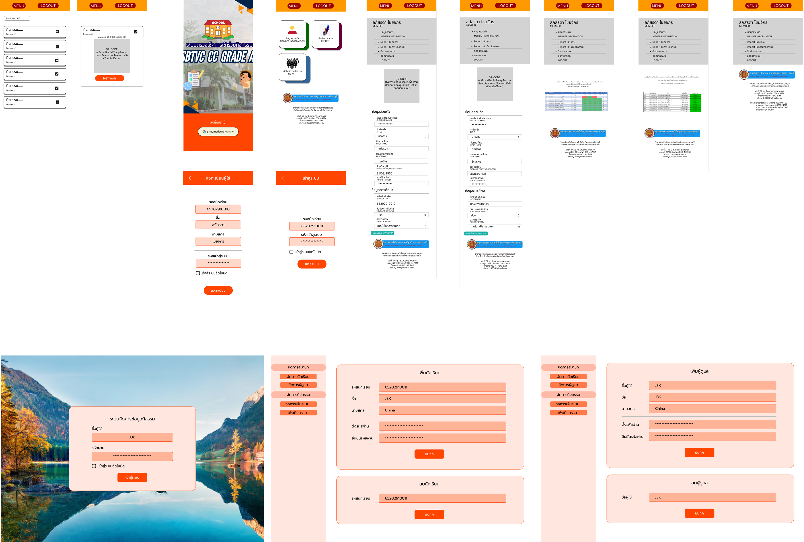
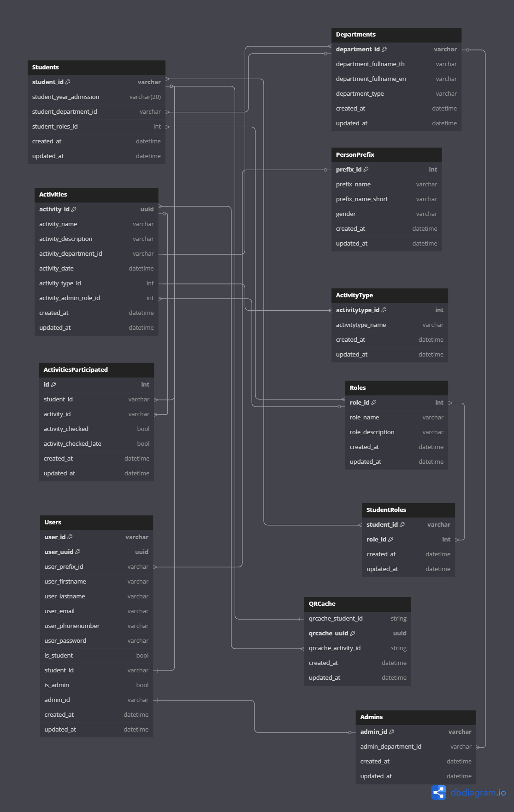

<h1>SBTVC Easy-Checkin</h1>

<h3>ระบบเช็คชื่อกิจกรรมนักเรียน วิทยาลัยอาชีวศึกษาเทคโนโลยีฐานวิทยาศาสตร์ (ชลบุรี)</h3>

Project PjBL ชิ้นที่ 5 โปรเจคสุดท้าย ของกลุ่ม ชมพู กอไผ่ เค้ก (SBTVC#15 / IT#2) โดยโปรเจคนี้ก็ตามชื่อคือระบบเช็คชื่อกิจกรรมก็คือให้นึกภาพเวลาเราไป Open house ของมหาวิทยาลัยที่เขาจะให้เราเเสดง QR Code ให้พี่เขาเเล้วพี่เข้าก็จะแสกนเป็นการ Checkin โปรเจคนี้ก็ได้เเรงบันดาลใจจากสิ่งนั้น ก็คือ ระบบนี้จะมีผู้ใช้ 3 ประเภทก็คือ 1)Student(คนที่เเสดง QR Code) 2)ActivityAdmin(เป็นนักเรียนที่สามารถเเสกน QR Code ของคนอื่นเพื่อลงทะเบียนได้) 3)Admin(ผู้ดูเเลสามารถจัดการระบบได้ทุกอย่าง มี Panel สำหรับ Admin โดยเฉพาะ) นักเรียนทุกคนจะมี QR Code เป็นของตัวเองเเต่ละกิจกรรมเเละจะ Reset QR Code ทุกๆ 1 นาที เพื่อเป็นการป้องกันการบันทึกไว้

<h2>คณะผู้จัดทำ (หลัก)</h2>
<ol>
    <li>
        
นส. สภัสลดา ไชยจักร (ชมพู) 🐕

    </li>
    <li>
        
นส. ประภาภรณ์ ภูผาลี (เค้ก) 👵

    </li>
    <li>
        
นส. พิชยา เงาปัดชา (กอไผ่) 🐖

    </li>
</ol>
<h2>คณะผู้จัดทำ (พิเศษ)</h2>
<ol>
    <li>
        
น. คณกร ไทยประโคน (กูเอง) 

    </li>
    <li>
        
น. คณกร ไทยประโคน (กูเหมือนกันเเค่คนที่ 2)

    </li>
    <li>
        
น. คณกร ไทยประโคน (กูเหมือนกันเเค่อยากให้ครบ 3 คน)

    </li>
</ol>

<h2>Stacks (Languages & Frameworks)</h2>
<ol>
    <li>
        
NextJS (App Router)

    </li>
    <li>
        
Typescript

    </li>
    <li>
        
TailwindCSS

    </li>
    <li>
        
ChakraUI

    </li>
    <li>
        
Prisma

    </li>
    <li>
        
MySQL

    </li>
    <li>
        
<a href="https://github.com/ImJustNon/Chompoo-PjBL5-Backend" target="_blank">ExpressJS (Deprecated)</a>

    </li>
</ol>

<h2>Host & Database</h2>
<ol>
    <li>
        
App ใช้ <a href="https://vercel.com/" target="_blank">Vercel</a>

    </li>
    <li>
        
Database(MySQL) ใช้ <a href="https://www.hostatom.com/" target="_blank">HostAtom</a>

    </li>
</ol>

<h2>UI Design</h2>
<a href="https://www.figma.com/design/BJOaGnP2W1YNOpCUwPsGIt/Design-Web-Gay%E0%B9%86?node-id=0-1&t=TqFd1l8zOKsTMgSF-1" target="_blank">
View Online on figma.com
</a>

<h2>Database Diagram (Relation Design)</h2>
<a href="https://dbdiagram.io/d/PjBL-5-เกๆ-678d15df6b7fa355c358757b" target="_blank">
View Online on dbdiagram.io
</a>

<h2>Requirements</h2>
<ul>
    <li>
        
node v.20.18.x

    </li>
    <li>
        
npm v.10.9.x

    </li>
    <li>
        
npx v.10.9.x

    </li>
    <li>
        
yarn v.1.22.x

    </li>
    <li>
        
tsx หรือ ts-node สำหรัน Run ไฟล์ .ts  

    </li>
    <li>
        
GIT

    </li>
</ul>

<h2>Installation Methods</h2>
<ol>
    <li>
        
ติดตั้ง NodeJS เเละโปรเเกรม Text Editor เช่น Visual Studio Code หรือ Notepad หรือ Word ขึ้นอยู่ว่าถนัดอะไรอ่ะนะ LOL

    </li>
    <li>
        
NPM เเละ NPX ส่วนมากถ้าลงเเบบใช้ Installer ของ Windows จะพ่วง 2 ตัวนี้มาด้วย สามาเช็คได้โดยใช้  <code>node -v</code> , <code>npm -v</code> , <code>npx -v</code> หากขึ้นเลข Version เเปลว่าใช้ได้เเล้ว

    </li>
    <li>
        
ติดตั้ง yarn , tsx โดยใช้คำสั่ง <code>npm install -g yarn tsx</code> หลังติดตั้งเสร็จใช้คำสั่งเพื่อเช็ค <code>yarn -v</code> , <code>tsx -v</code> หากขึ้นเลข Version เเปลว่าใช้ได้เเล้ว

    </li>
    <li>
        
Clone Repository โดยใช้คำสั่ง GIT นี้ <code>git clone https://github.com/ImJustNon/Chompoo-PjBL5-FullStack.git</code> หรือ <a href="https://github.com/ImJustNon/Chompoo-PjBL5-FullStack/archive/refs/heads/main.zip">Download zip</a> เเล้วเเตกไฟล์ให้เรียบร้อย

    </li>
    <li>
        
ตั้งค่า Evironment Variable โดยสร้างไฟล์ชื่อ <code>.env</code> จากนั้น Copy โค้ด จาก <code>.env.example</code> มาเเละตั้งค่า MySQL Connection String โดยมีรูปเเบบคือ <code>mysql://[username]:[password]@[host]:[port]/[database]</code> เเละ <strong> DATABASE_URI กับ DATABASE_SHADOW_URI ห้ามใช้ Database ตัวเดียวกัน</strong> (ทำไมก็ไม่รู้ ¯\_(ツ)_/¯) 

    </li>
    <li>
        
Migration Database เพื่อสร้าง Structure ใน Database ตามที่กำหนดใน schema.prisma โดยใช้คำสั่ง <code>npx prisma migrate dev</code> จากนั้นมันจะถามชื่อก็ตั้งชื่อ Migration อะไรก็ได้

    </li>
    <li>
        
สร้างข้อมูลเริ่มต้น เช่น User, Roles, Admin, etc. โดยใช้คำสั่ง <code>tsx ./prisma/seed.ts</code> หากขึ้น ✅ ทั้งหมดเเปลว่า OK

    </li>
    <li>
        
Optional : สามารถใช้ Prisma Studio สำหรับเเก้ไขจัดการข้อมูลใน Database ได้โดยใช้คำสั่ง <code>npx prisma studio</code>

    </li>
    <li>
        
ติดตั้ง Dependencies โดยเปิด Terminal ใน Project เเละใช้คำสั่ง <code>yarn install</code> รอติดตั้งให้เสร็จ

    </li>
    <li>
        
RUN DEVELOPMENT : ใช้คำสั่ง <code>yarn dev</code> Terminal จะเเสดง Link Localhost มาใช้สำหรับเข้าไปดูผล

    </li>
    <li>
        
RUN PRODUCTION : ใข้คำสั่ง <code>yarn build</code> เพื่อ Compile ก่อน จากนั้นใช้คำสั่ง <code>yarn start</code> เพื่อ Run Project จากนั้น Terminal จะเเสดง Link Localhost มาใช้สำหรับเข้าไปดูผล

    </li>
</ol>

 

<h3 align="center">Made with 💗 by The Greatest Programer That Ever Live</h3>